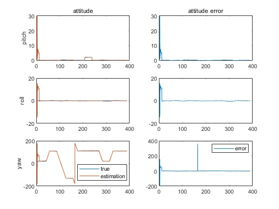
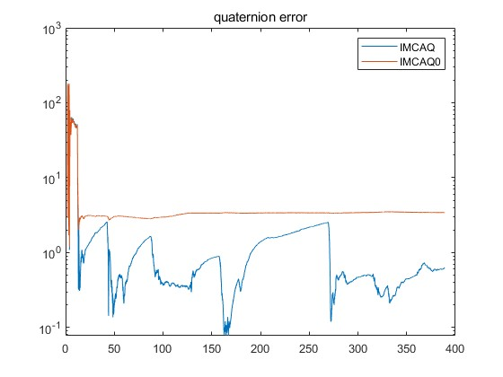
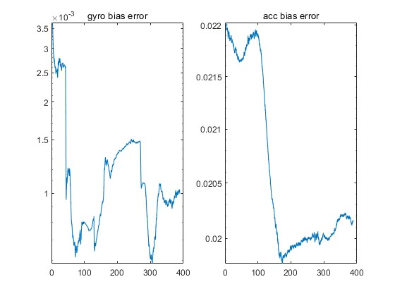

# Initial Coarse Alignment

This code is used to achieve the coarse initial attitude before the navigation. The realization of this code refer the paper "A High-Accuracy GPS-Aided Coarse Alignment Method for MEMS-Based SINS". The code is reproduced by myself and does not verified by the author of the reference. 

reference paper link DOI：10.1109/tim.2020.2983578

## Dependency
1. Running in Matlab 2022b
2. depend on the psins toolbox that can be achieved by https://www.psins.org.cn/ or https://github.com/WangShanpeng/PSINS

## Result
attitude:

quaternion rotation angle error:

bias estimation error:

# Acknowledgment:
Thanks Dr. Gongmin Yan's open source code psins toolbox from https://www.psins.org.cn/ in Northwestern Polytechnical University of P.R.China.

#
data: 15/02/2025 \
lu email: zhong.yulu.ll@gmail.com or yulu_zhong@seu.edu.cn